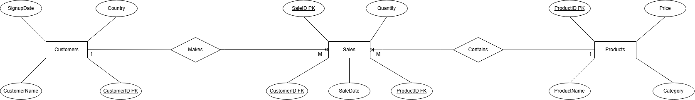
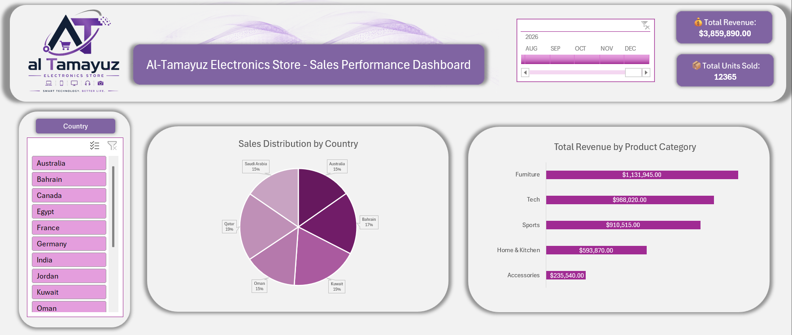

# Al-Tamayuz Sales Analytics Project

## Project Overview

This project is an end-to-end sales analytics case study for a fictional electronics store called Al-Tamayuz.

The project analyzes sales performance using a structured SQL database and an interactive Excel dashboard. The dataset includes 300 customers, 100 products, and 5,000 sales transactions across multiple countries and product categories.

## Objective

The objective of this project is to analyze sales performance, customer behavior, product category performance, and country-level revenue distribution to generate clear business insights and recommendations.

## Tools Used

- SQL Server
- Excel
- Power Query
- Pivot Tables
- PowerPoint
- GitHub

## Dataset Structure

The database contains three main tables:

### Customers Table
- Customer_ID
- Customer_Name
- Country
- Signup_Date

### Products Table
- Product_ID
- Product_Name
- Category
- Price

### Sales Table
- Sale_ID
- Customer_ID
- Product_ID
- Quantity
- Sale_Date

The Sales table acts as a bridge table between Customers and Products.

## Entity Relationship Diagram



## Analysis Performed

The SQL analysis covered:

- Total revenue
- Total units sold
- Revenue by product category
- Revenue by country
- Top customers by spending
- Top-selling products
- Year-over-year performance
- Database optimization plan

## Dashboard Preview



## Key Insights

- Furniture, Tech, and Sports were the top revenue-generating categories.
- Some countries generated stronger sales performance than others.
- A small group of high-value customers contributed significantly to total revenue.
- Year-over-year analysis showed business growth between 2024 and 2025, followed by a decline in 2026 compared to the same period of the previous year.

## Recommendations

- Reallocate premium stock to high-performing countries to avoid stockouts.
- Improve sales in underperforming countries using localized campaigns.
- Build stronger relationships with high-value customers through loyalty programs and personalized offers.
- Add indexes on Customer_ID, Product_ID, and Sale_Date if the Sales table grows significantly.

## Repository Structure

```text
al-tamayuz-sales-analytics/
│
├── data/
│   ├── customers.csv
│   ├── products.csv
│   └── sales.csv
│
├── sql/
│   ├── 01_create_tables.sql
│   ├── 02_analysis_queries & optimization_plan.sql
│
├── dashboard/
│   ├── Al_Tamayuz_Dashboard.xlsx
│   └── dashboard_screenshot.png
│
├── presentation/
│   ├── Al Tamayuz Analysis.pptx
│   └── Al_Tamayuz_Summary.pdf
│
├── images/
│   ├── erd_diagram.png
│   └── project_cover.png
│
└── README.md
